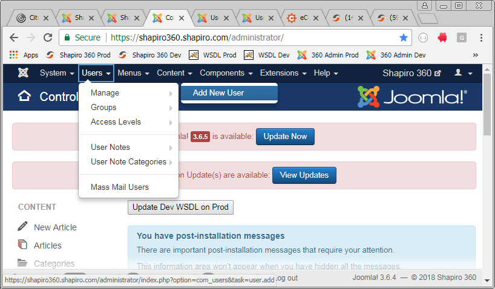
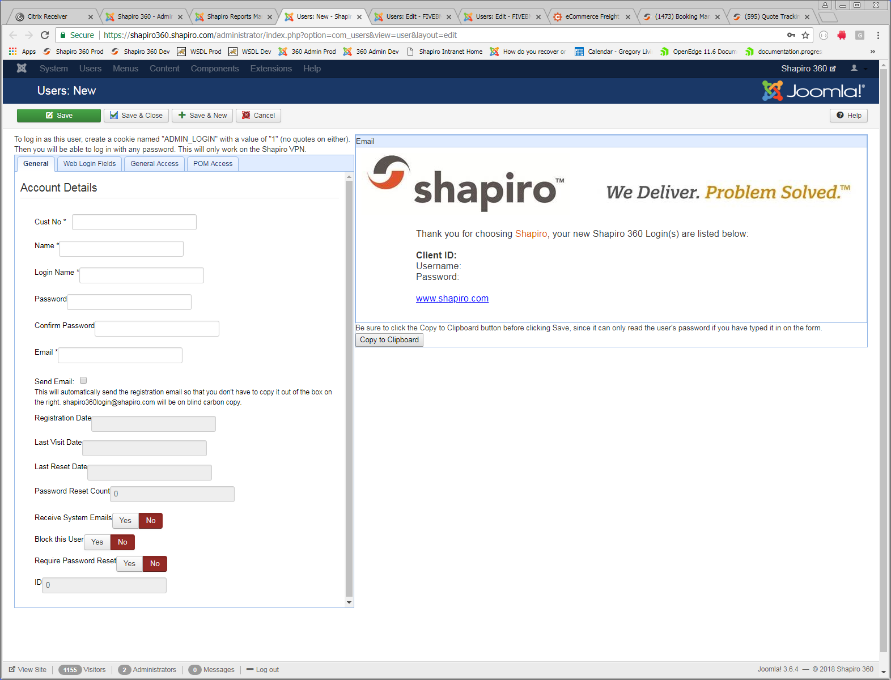

# New Shapiro 360 Login

These are instructions on how to set up a 360 user. To query this information, you will need to query the MySQL database that Joomla saves into. (MySQL Workbench is nice.)

1.	Log into the Shapiro 360 admin: https://shapiro360.shapiro.com/administrator
*	At the top, select Users -> Manage -> Add New User.
    
*	General tab:
    *	Cust No – A comma-delimited list of customer codes.
    *	Name – The customer code, a dash, and their name. For example: “JOIEJEAN - John Doe”.
    *	Login Name – Typically, the user’s email address. If you are setting up a test account for internal use, this will be the customer code in lowercase.
    *	Password – Make something up. This thing is nice: https://www.warpconduit.net/password-generator/
    *	Confirm Password – Use the same password.
    *	Email – The user’s email address. If you are setting up a test account for internal use, this will be the customer code @shapiro.com. For example: “joiejean@shapiro.com”.
    *	Send Email – You can check this if you like. It will send an email to the user containing their credentials. Ecomm wants you not to do this.
    *	Block this User – Flip to “yes” to ban a user.
    *	Copy to Clipboard – This copies the user credential form into your clipboard (if you are using Firefox or Chrome). You can use this to paste (Ctrl +V) it into an email to Ecomm.
        
*	Web Login Fields tab:
    *	Web Login Fields
        *	Charge Cust – If the user has multiple customers, and they need Online Payment, you will have to set this to one customer.
    *	Purchase Order Management
        *	Cust No – The customer code for the POs this user should see. Typically the same as the “Cust No” on the first tab.
        *	Roles – “CUSTOMER”, “SUPPLIER”, “AGENT”, “SHAPIRO”
        *	Vendors – This should match the vendor code in a cust-po record (cust-po.vendor). If it’s blank, then the user will see all POs for the customer.
        *	Agent Cust No – The agent’s code in our system. This will go in shiphead.foreign-agent.
        *   Email Booking Details to Address – If this user makes a change to a booking in POM Booking, then the update will be emailed to the email address specified here.
    *	Booking Approval Fields
        *	Booking Approval Cust-No – The customer code for the bookings this user should see. Typically the same as the “Cust No” on the first tab.
        *	Allow Shipment Approval – Yes if the user should be able to move bookings from pending to approved.
        *	Allow Shipment Notes – Yes if the user should be able to add notes to a booking.
        *	Allow Delivery Location Change – Yes if the user should be able to change the delivery location on a booking.
*	General Access tab:
    *	App Code Access
        *	If it’s an ecomm user, click “Ecomm User”. This will set everything you need.
        *	Otherwise, see if a user already exists for the customer. If so, copy permissions from them.
        *	If you can’t do either of the above, then go back to the person who requested this user and ask what access they should have.
    *	Reports
        *	Determine which reports the user should be able to see on the Reports page.
*	POM Access tab:
    *	These are PO-related pages.
