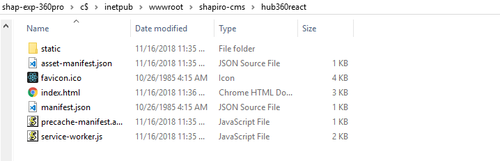

# Developer Documentation

[<< back](/Hub360/about)

## Local Setup

###### If you don't have Git, [download it here](https://git-scm.com/downloads)
```bash
git clone //shap-exp-360pro/c$/inetpub/wwwroot/shapiro-apps/hub360repo
```

``` cd hub360repo ``` and Install the package.json with ``` npm install ``` to procure all required Node_Modules.

When ready to development/testing, ``` npm start ``` to spin up a local server with a development build. It has a hot-reload so every save will re-compile and refresh the browser window. This app also comes bundled with SASS so we won't be relying on classic css.

__Note__: At the time of writing, WSDL calls do not allow for CORS access so will all fail. The only way to test WSDL calls is to get a [production build](#production-build-setup) up on the shapiro360 server.

---

## Error Logs

```bash
cd /usr5/dailyreports/kkim/0-logs/hub360/downloads   // Monthly 
cd /usr5/dailyreports/kkim/0-logs/hub360/renames     // Monthly
cd /usr5/dailyreports/kkim/0-logs/hub360/uploads     // Daily
```
---

## Production Build Setup
At the time of writing, pushing a production build requires manual editing.

After running ``` npm run build ```, drag the files from the _build_ folder out to a folder on the Shapiro360 server of your choice. In my examples, I use _/inetpub/wwwroot/shapiro-cms/hub360react/_.



Afterwards, you'll need to edit the index.html to swap out all paths from _/static/_ with _/hub360react/static/_ or whatever folder.

This would be reachable via _https://shapiro360.shapiro.com/hub360react/_, or replacing _hub360react_ with whatever folder.

---

## React Parent-Child Relationships

```../src/App.jsx``` is the main parent component. It contains the initial state and defines.

```../src/components/``` holds all of the child components such as ```SearchForm.jsx```, ```DocList.jsx```, and so on.

Note: When you need a child component to affect the state of its sibling or parent, you'll need to pass the values to the parent first. Everything is one-way parent-to-child inheritance based. 

**App.jsx**
```jsx
class App extends Component {
    constructor(props) {
        super(props);
        this.state = initialState;
        // Search Bar Input
        this.handleInputChange        = this.handleInputChange.bind(this); 
        ...
    }
    handleInputChange(e) {
        e.preventDefault();
        let validCheck = 'form--invalid'; // Reject Alphabet/special chars.

        // ShapiroIDs definitely only use numbers.
        if( e.target.value.match('^[0-9]+$') || e.target.value === '' ) {
            validCheck = 'form--valid'; // Must be numerical chars only.
            if( e.target.value.length < 7 ) { validCheck = 'form--incomplete'; } // Must be 7 chars before submit
        }
    
        this.setState({
            fileID: e.target.value,
            fileID_Valid: validCheck,
        })
    }
    ...
    render(){
        ...
        return(
            <SearchForm 
                passHandleInputChange = {this.handleInputChange} 
                //...
            />
            ...
        )
    }
```

In the ```App.jsx``` file, we've first bound the function to this component, then defined it, then passed it into the SearchForm React element.

We also perform a ```this.setState()``` within the ```handleInputChange()``` define. This will update the App State, which will cause a re-render of App and all child components.

By passing ```{this.handleInputChange}``` into ```SearchForm``` we are sending the function as a prop named ```passHandleInputChange```.

Also notice that we use CapitalCamelCase for React elements. This is mandatory. 

**SearchForm.jsx**
```jsx
class SearchForm extends Component {
    ...
    render(){
        ...
        return (
            <div>
                <form>
                    <div className="form-inline">
                        <input 
                            placeholder="Shapiro File ID"
                            className="form-control input_bar" 
                            maxLength="7" 
                            onChange={this.props.passHandleInputChange} 
                            //...
                        />;
                        ...
                    </div>
                </form>
            </div>       
        )
    }
```

In ```SearchForm.jsx```, we are attaching the previously passed ```passHandleInputChange``` prop to an onChange event for the ```input``` element as ```{this.props.passHandleInputChange}```.

Every change in this input field will trigger the ```handleInputChange()``` function, which ends in a setState that triggers a re-render of the App component, which subsequently triggers a re-render on all of its child components, SearchForm included.

This is the same process for getting a child component to affect a sibling component.

---

## React Conditional Piece-Meal Rendering

Hub360 is written in JSX, which allows for html-like and css-like language, but at the end of the day, still behaves as Javascript.

The below is basic example of using js' conditional to alter how React will render the html-like language.

**ColorKey.jsx**
```jsx
export default class ColorKey extends React.Component {
    render() {

        let warningText = " - Document name can't match to File. File ID will be auto-added on upload.";
        if ( this.props.indexMode === "custdocs" ) {
            warningText = " - Document name can't match to Customer. CustNo will be auto-added on upload."
        } else if ( this.props.indexMode === "fppidocs" ) {
            warningText = " - Document name can't match to Agent-FPPI or is missing -FPPI- tag. Hub360 will auto add the Agent and FPPI tags. "
        }

        return (
            <div className="row upload__key">
                ...
                <div className="col-12 col-md-4">
                    {warningText}
                </div>
                ...
            </div>
        );
    }
}
```

This can apply for entire elements as well;

**DocList_Controller.jsx**
```jsx
export default class Controller extends React.Component {
    render() {
        let downloadButton =
            <button 
                className = "btn btn-primary" 
                disabled >
                <i className="fa fa-download"></i>&nbsp;Download
            </button>;
        if ( this.props.hasSelection === true || this.props.selectAll === true ) {
            downloadButton = 
            <button 
                className = "btn btn-primary" 
                onClick   = {this.props.passHandleZipGen('selected')}>
                <i className="fa fa-download"></i>&nbsp;Download
            </button>; 
        }    

        return (
            <div className="doclist__controller">
                {downloadButton}
            </div>
        )
    }
}
```

Keep in mind that JSX can only recognize one element at a time however. 
Valid Example:
```jsx
downloadButton = 
    <button>...</button>
``` 

Invalid:
```jsx
downloadButton = 
    <button>...</button>
    <span>...</span>
```

But your single element can contain as many child elements as you wish; 
```jsx
downloadButton = 
<button>
    <span>
        <i>...</i>
    </span>
    <span>...</span>
</button>
```

---


