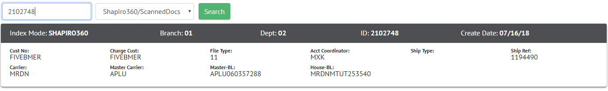

# User Guide

[<< back](/Hub360/about)

## General Guide

The Hub will always default to filtering for Shapiro360 documents. This can be changed via the dropdown to filter through **GLG/Transdocs**, **Customer Docs**, and **FPPI Authorizations**.

When searching for a File, a valid File ID must be provided. When filtering for a Customer Doc or an FPPI Authorization however, you must use a valid **CustNo** or **AgentNo**.

---

## File/Customer Detail

Shapiro360/GLG docs will return a File Details bar that contains CustNo, File Types, Acct Coordinators, etc.

For Customer Docs/FPPI Authorizations, you'll receive a Customer Detail bar that will display phone numbers, address, Consignees, etc.

---

## Downloading & Renaming existing Documents

If documents are found, you can click on individual names to preview the doc, or select any number of documents via checkbox to download a .ZIP of the documents.

To rename a document, click the "Edit Mode" at the top right of the listing. When complete, exit the edit mode and click "Save" at the bottom right.

---

## Uploading New Documents

You can either click the area within the orange outline or drag files directly into it to begin processing documents.

To release these documents to upload a different batch, click Start Over on the bottom left of the Upload listing.

Documents will highlight in either red, yellow, or green.

* **Red** - Danger, this document has the same name as one already uploaded. If you do nothing, Hub360 will overwrite the old one.
* **Yellow** - Warning, this document's name doesn't quite match the naming convention. If you do nothing, Hub360 will rename the file on your behalf to match.
* **Green** - Accepted, no problems detected

Document Names can be edited by clicking the Edit Mode button on the top-left of the Upload Listing.

Documents with an unaccepted extension ( eg. .MSG, .HTML, .XYZ ), will automatically be rejected and listed below.
