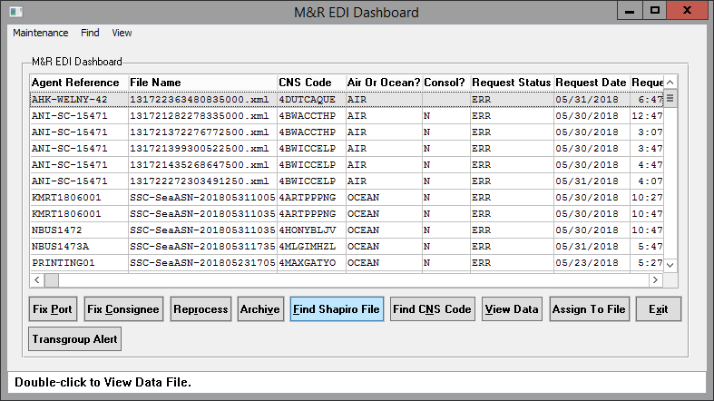
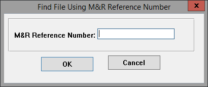
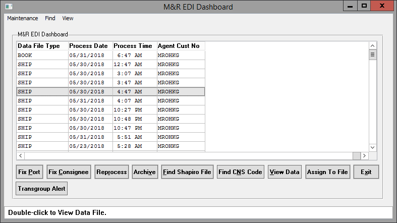
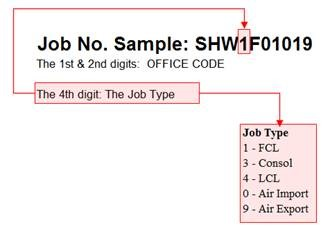
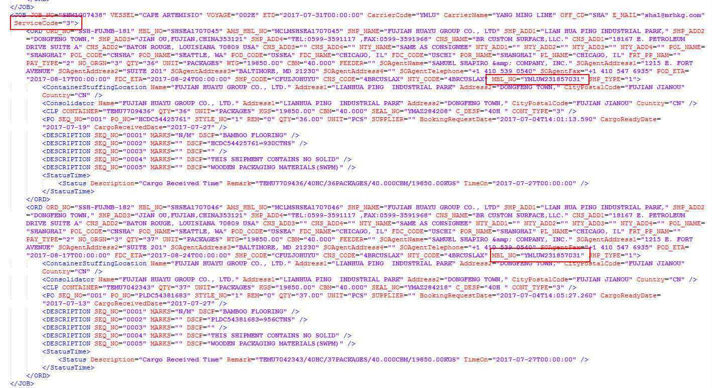

# M+R ASN Load

imp/mrship-v2.i
imp/mrship-v2-ocean.p
imp/mrship-v2-air.p

## Background

### Scheduled

M+R contacts Shapiro through FTP. They place files into /usr5/ftproot/mrspedag/inbox.

There is a flow of programs from one to the next:

*	The demon1 crontab runs /usr/bin/hourlyedi.
*	That runs /usr/bin/runmrfwd2.
*	That runs /usr/bin/mxpmrfwd.pf.
*	That runs /progs/mxp/mxp81e/shapsrc/imp/mrfwd.p.

imp/mrfwd.p examines each XML file in /usr5/ftproot/mrspedag/inbox and labels the EDI type.

If the EDI type is ocean ASN, it gets sent to imp/mrship-v2-ocean.p. If the EDI type is air ASN, it gets sent to imp/mrship-v2-air.p.

The workings of imp/mrfwd.p are a matter for another document.

### Automation

This can be run through “mredidash” in Automation.



Click “Find Shapiro File”. Insert the M+R reference number. This is the agent-edi-queue.agent-id and the shiphead.agent-id. You can find it on page 2 of Import Entry.



Once you have that, highlight the EDI you want to re-run, and click “Reprocess”. If the EDI is an ASN, this will run the ASN program with force = yes. The EDI is an ASN if “Data File Type” is “SHIP”. Scroll to the right in the browser to see it.



Note: this means there will be no regard for whether the ASN deletes POs or other important information. It will run no matter what.

## Program

The program writes M+R data into temp-tables named after real database tables (tt-shiphead, tt-bookeq, etc.). After everything is written, those temp-tables are buffer-copied into the database proper, like so:

```
buffer-copy tt-shiphead into shiphead.
```

In the below documentation:
*	“Include” refers to mrship.i.
*	“Ocean” refers to mrship-v2-ocean.p.
*	“Air” refers to mrship-v2-air.p.

### Parameters

These are the same between Ocean and Air.

*	Input
    *	rowid-agent-edi-queue
        *	This is the row ID of an agent-edi-queue record. One M+R update can create a family of database tables. The agent-edi-queue record ties them all together.
    *	force
        *	This is a logical. Normally, force should be no. This means we will not run the EDI if there is a problem. (For example, we will prevent the EDI from deleting POs on a file.) If force is yes, then we will run the update heedless of the consequences.

### Body

The overall flow of procedures:

1.	i-process-edi – Run the update and save it to the database.
    1.	p-do-update – Create temp-tables from M+R data.
        1.	p-update-shiphead
        *	p-update-bolhd
        *	p-update-bolparties
        *	p-default-bookeq
        *	p-update-bookeq
        *	p-update-commodity-detail
        *	i-update-boleq
    *	i-save-to-db – Save the M+R temp-tables to the database.

### Internal Procedures

If a procedure name begins “i-“, it appears in the Include. If a procedure name begins “p-“, it appears in Ocean, Air, or both.

A procedure will be in the Include if its logic is common to both ocean and air files. Otherwise, if the logic is particular, the procedure will appear in Ocean, Air, or both.

The programs are split up because ocean ASNs go into mr-shipment and air ASNs go into mr-bl. The logic is similar but based off of different database tables and fields.

#### Include

*	i-process-edi
    *	Labels the EDI as a consolidation or a normal file.
    *	Checks if the update should be run (i-can-update).
    *	Runs the update (p-do-update).
    *	Assigns the request status in agent-edi-queue.
*	i-can-update
    *	Skips the update if there is an NEUP problem code.
    *	If the ONBD problem code is solved, and you are going to erase certain equipment data, don’t run the update.
        *	This builds an email using p-prep-equip-diff.
*	i-add-bolparties
    *	Add a BOL party to a shipment.
        *	This creates tt-bolparties records to be buffer-copied into the database later.
*	i-save-to-db
    *	Buffer-copy all of your temp-tables into the database.
    *	This also handles shiphead maintenance.
        *	Create problems
        *	Write notes
        *	Send emails
        *	Create the agent file cross reference (translates the agent ID to a Shapiro ID)
        *	Update Vbin
        *	Run diffs 
*	i-chk-credit-limit
    *	Send an alert based on certain conditions. This just calls external programs to do all of the work.
*	i-save-bolhd
    *	Buffer-copies:
        *	tt-bolhd into bolhd
        *	tt-bolparties into bol-parties
*	i-save-bookeq
    *	Buffer-copies
        *	tt-bookeq into bookeq
        *	tt-boleq into boleq
        *	tt-commodity into commodity
        *	tt-bol-commodity into bol-commodity
        *	tt-commodity-ext-desc into commodity-ext-desc
        *	tt-bol-commodity-ext-desc into bol-commodity-ext-desc
        *	tt-commodity-detail into commodity-detail
        *	tt-bol-commodity-detail into bol-commodity-detail
*	i-update-cust-po
    *	Update POs to label them as booked.
    *	Send an alert if you see a bad I&K PO (i-store-email).
*	i-store-note
    *	Create a tt-ship-note record. This will be written into the notes table later.
    *	The point of this is to prevent writing notes if the program encounters an error.
*	i-write-notes
    *	Runs through all of your tt-ship-note records and creates proper notes records.
*	i-store-email
    *	Store an email code to be sent later.
    *  	A code maps to a particular type of email.
*	i-send-emails
    *	Send each email that was stored using i-store-email.
*	i-crt-single-prob
    *	Create a ship-problems record.
*	i-update-boleq
    *	Create tt-bol* records based on tt-bookeq and tt-commodity* tables.
    *	The idea is to recreate all of your equipment information in BOL tables.
*	i-crt-equip-diff
    *	Go through every tt-bookeq record and compare it to its matching bookeq record.
    *	The point is to list the differences between what’s in bookeq now and what would be in bookeq if we ran the update.
    *	This is used by p-prep-equip-diff, which in turn is used by i-can-update.

#### Ocean

*	p-do-update
    *	For this EDI, find the related M+R tables.
        *	agent-edi-queue will point to mr-shipment.
        *	mr-shipment will point to mr-clp and mr-ship-po.
    *	Run the update.
        *	p-update-shiphead
        *	p-update-bolhd
        *	p-update-bolparties
        *	p-default-bookeq
        *	p-update-bookeq
        *	p-update-commodity-detail
        *	i-update-boleq
        *	i-save-to-db
    *	This will run updates differently if an EDI is for a consolidation shipment or a regular shipment.
        *	If it’s a regular shipment, there will be only one mr-shipment record.
        *	If it’s a consolidation, there will be one mr-shipment record per order on the consolidation.
    *	If you have customer-specific logic, please consider putting it in procedure p-do-update-customer-specific.
*	p-update-bolparties
    *	Read BOL parties out of mr-shipment.
*	p-update-bolhd
    *	Read BOL header information out of mr-shipment.
*	p-cancel-consol-input
    *	If this update is a consolidation, cancel any bookings that went into this consolidation.
        *	In a consolidation, there are a series of mr-shipment records. They share one job number (job-no), and they each have a unique order number (agent-id).
        *	The order number will match the shiphead.agent-id on a shipment. Cancel that file.
    *	If an order gets taken off of a consolidation, go back and un-cancel that file.
*	p-update-shiphead
    *	Create the tt-shiphead record for applying updates.
    *	Check if you want to skip shiphead-level updates (p-skip-shiphead).
    *	Read mr-shipment and apply updates to tt-shiphead.
*	p-location-notes
    *	p-update-shiphead calls this to write notes and create isf-parties based on the mr-stuffing and mr-consolidator tables.
*	p-crt-probs
    *	Create any ship-problems applicable to a shipment.
    *	Calls i-crt-single-prob.
*	p-skip-shiphead
    *	p-update-shiphead calls this to check if you should skip shiphead-level updates.
    *	Skip shiphead-level updates if ONBD is solved.
*	p-create-tt-shiphead
    *	Called by p-update-shiphead to initialize the tt-shiphead record for applying updates.
    *	Try to find an existing shiphead.
    *	If it doesn’t exist, create it and set it up (p-shiphead-setup).
*	p-find-shiphead
    *	Called by p-create-tt-shiphead to see if a shiphead already exists for this shipment.
    *	Look in agent-file-cross-ref.
    *	If that doesn’t work, try to match on bookeq.master-bl.
*	p-shiphead-setup
    *	Default a shiphead record from scratch. This is used if you can’t find an existing shiphead for your update.
    *	Apply information based on mr-office and agent-cns-cust-ref (agent/consignee customer reference—this gets you the cust-no).
*	p-reset-bookeq
    *	Clear out equipment tables before saving updates to the database.
    *	This is called by i-save-to-db.
    *	This will set an error and prevent saving to the database if:
        *	The shipment currently has a bookeq record
        *	The tt-bookeq table is empty
        *	This means we’d delete all containers and create nothing.
        *	This also applies to the commodity-detail table.
*	p-update-bookeq
    *	Create tt-bookeq records based on mr-shipment and mr-clp.
    *	Runs p-update-commodity-detail for any POs associated with this container.
*	p-update-commodity-detail
    *	Create tt-commodity-detail records based on mr-ship-po.
    *	If there’s no container associated with mr-ship-po, see if any other mr-ship-po records match your style number.
        *	If there are some with a container number, don’t run this update.
        *	If there are none with a container number, run this update. Default the PO into the first container.
*	p-default-bookeq
    *	Create a container for each order just by default.
    *	This doesn’t run if you have an mr-clp record for the order.
    *	Create tt-bookeq based on mr-shipment.
*	p-default-commodity
    *	Called by p-default-bookeq.
    *	Create a default tt-commodity record.
*	p-prep-equip-diff
    *	Call p-update-bookeq to create tt-bookeq records.
    *	We won’t save tt-bookeq to the database. This is just to compare the EDI against what’s in our database.
    *	This calls i-crt-equip-diff to find the difference between tt-bookeq and bookeq.
*	p-do-update-customer-specific
    *	Runs customer-specific logic for files.

#### Air

*	p-do-update
    *	For this EDI, find the related M+R tables.
        *	agent-edi-queue will point to mr-bl.
        *	mr-bl will point to mr-bl-po.
    *	Run the update.
        *	p-update-shiphead
        *	p-update-bookeq
        *	p-update-commodity-detail
        *	i-save-to-db
    *	This will run updates differently if an EDI is for a consolidation shipment or a regular shipment.
        *	If it’s a regular shipment, there will be only one mr-bl record.
        *	If it’s a consolidation, there will be one mr-bl record per order on the consolidation.
*	p-cancel-consol-input
    *	If this update is a consolidation, cancel any bookings that went into this consolidation.
        *	In a consolidation, there are a series of mr-bl records. They share one job number (job-no), and they each have a unique order number (agent-id).
        *	The order number will match the shiphead.agent-id on a shipment. Cancel that file.
    *	This does not have the un-cancel logic that Ocean does.
*	p-update-shiphead
    *	Create the tt-shiphead record for applying updates.
    *	Check if you want to skip shiphead-level updates (p-skip-shiphead).
    *	Read mr-bl and apply updates to tt-shiphead.
*	p-crt-probs
    *	Create any ship-problems applicable to a shipment.
    *	Calls i-crt-single-prob.
*	p-skip-shiphead 
    *	p-update-shiphead calls this to check if you should skip shiphead-level updates.
    *	Skip shiphead-level updates if ONBD is solved.
*	p-create-tt-shiphead 
    *	Called by p-update-shiphead to initialize the tt-shiphead record for applying updates.
    *	Try to find an existing shiphead.
    *	If it doesn’t exist, create it and set it up (p-shiphead-setup).
*	p-find-shiphead 
    *	Called by p-create-tt-shiphead to see if a shiphead already exists for this shipment.
    *	Look in agent-file-cross-ref.
    *	This does not try to make a match on bookeq.master-bl.
*	p-shiphead-setup 
    *	Default a shiphead record from scratch. This is used if you can’t find an existing shiphead for your update.
    *	Apply information based on mr-office and agent-cns-cust-ref (agent/consignee customer reference—this gets you the cust-no).
*	p-reset-bookeq
    *	Clear out equipment tables before saving updates to the database.
    *	This is called by i-save-to-db.
    *	This will set an error and prevent saving to the database if:
        *	The shipment currently has a bookeq record
        *	The tt-bookeq table is empty
        *	This means we’d delete all containers and create nothing.
    *	This also applies to the commodity-detail table.
*	p-update-commodity-detail 
    *	Create tt-commodity-detail records based on mr-bl-po.
    *	There’s no container logic to worry about. It just defaults POs into the first container for this order. (If it’s a consolidation, then there could be POs in multiple containers, since each order would have its own container.)
*	p-update-bookeq
    *	Create a tt-bookeq record for this shipment based on mr-bl.
    *	Air ASNs do not have a table for specifying containers.
*	p-update-commodity
    *	Default a tt-commodity record based on tt-bookeq.
*	p-addl-commodity
    *	Create additional tt-commodity records based on mr-bl-dim.
*	p-update-commodity-ext-desc
    *	Create tt-commodity-ext-desc records based on mr-bl-desc.
*	p-prep-equip-diff 
    *	Call p-update-bookeq to create tt-bookeq records.
    *	We won’t save tt-bookeq to the database. This is just to compare the EDI against what’s in our database.
    *	This calls i-crt-equip-diff to find the difference between tt-bookeq and bookeq.

## Job Type

From: M+R HKG - YINNIS SO [mailto:yinnis.so@hk.mrspedag.com] 
Sent: Wednesday, April 13, 2016 11:21 PM
To: Matthew Kobussen <matthew@shapiro.com>
Cc: Mike Baker <mikeb@shapiro.com>; Bob Kimmel <bob@shapiro.com>; 'M+R HKG - SING TSANG' <sing.tsang@hk.mrspedag.com>
Subject: M+R Job Number Definition

Hi Matt,

As discussed, following is the “Job Type” (4th character) definition of M+R Job Number.



Best Regards,
Yinnis So
General Manager IT Asia

Service Code

From: M+R HKG - Ruby Wong [mailto:ruby.wong@hk.mrspedag.com] 
Sent: Friday, July 28, 2017 05:03
To: 'M+R SHA - Sophia Jun' <sophia.jun@cn.mrspedag.com>; Hasmiou Idrissou <Hasmiou@shapiro.com>; Gregory Livingston <gregory@shapiro.com>
Cc: transcustsurf <transcustsurf@shapiro.com>; 'judy.yang.sha@cn.mrspedag.com' <judy.yang@cn.mrspedag.com>; 'M+R SHA - Ada Huang' <ada.huang@cn.mrspedag.com>; 'M+R HKG - SING TSANG' <sing.tsang@hk.mrspedag.com>; ruby.wong@hk.mrspedag.com
Subject: RE: SSH-FUJMB-182 (Shapiro 2029999)and SSH-FUJMB-181 (Shapiro 2029998).............FW: 2029998

Hi Greg,

Please advise if 360 started to use the “ServiceCode” to identify consolidated shipments. 
For SSH-FUJMB-181, MBL# of the 2 S/O is the same and the “Service Code” of this job is “3” which indicates that this is a CONSOL booking. Attached 131457048271636250_SHW1G07438.xml for your reference. Thank you.



Best Regards,
Ruby Wong 
Logistics Department
 
M & R Forwarding (HK) Ltd.
Rm 3501, 35/F, Manhattan Place,
23 Wang Tai Road, Kowloon Bay,
Hong Kong SAR.
Dir: +852 3122 0806
Tel: +852 2591 0677
Fax: +852 2893 0817
 
Email: ruby.wong@hk.mrspedag.com
Web: www.mrspedag.com

