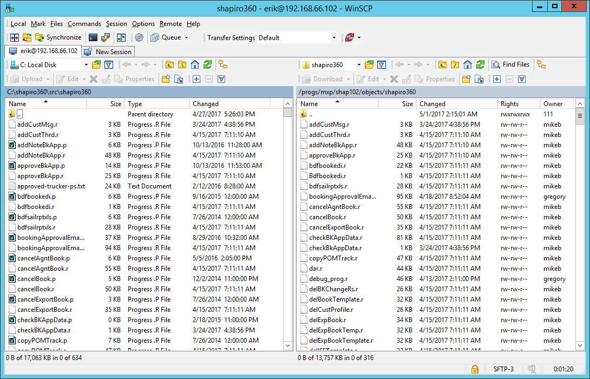

1.	Make sure that you compile any programs that you want added to the WSDL 

2.	Login to Shap-exp-360pro for Production or Shap-exp-360dev for Development.
3.	Launch WinSCP
4.	Move over the .r files, of the programs you complied in Step 1 (See below for the directory names) 

5.	Launch the proxy generator 

6.	Hit the folder icon and navigate to C:\shapiro360 and chose ShapiroProd or ShapiroDev

7.	The hit Procedure->Add->Non-Persistent 
8.	Hit save and then hit   to generate the WSDL
9.	Next go back to WinSCP and navigate to the below folders
10.	Drag ShapiroProd.xpxg from the left panel to the right panel.  If you get and error the delete the file on the right side and then drag over the file.
11.	Open up a rashi6 session and cd to /home/allegro/bin and run either xpxgdev-build.sh or xpxgprod-build.sh 
12.	You should receive a message that this run was successful. 
13.	Next go to http://192.168.66.102:9090
14.	Go to the Web Services Adapter section and select either shap-exp-rashi6.wsadevShapiro360 or shap-exp-rashi6.wsaprodShapiro360
15.	Got t Status Enablement and disable the Web Service Adaptor.
16.	Then go back to the previous screen and hit Update.
17.	Type /progs/mxp/shap102/objects/ShapiroProd.wsm or /progs/mxp/shap102test/objects/ShapiroDev.wsm and hit submit.
18.	Click through the next page and you should receive a message that it was updated. 
19.	Lastly right click and open Configure Tomcat as administrator 
20.	Click stop, wait about 10 seconds and then start tomcat.