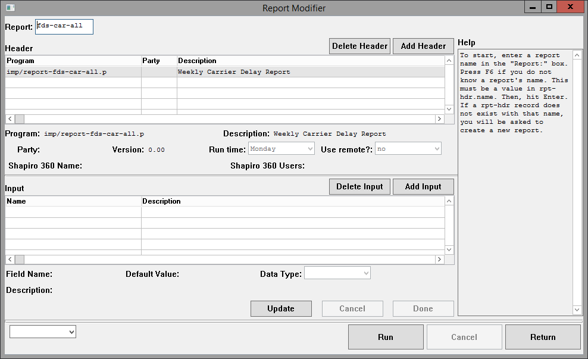
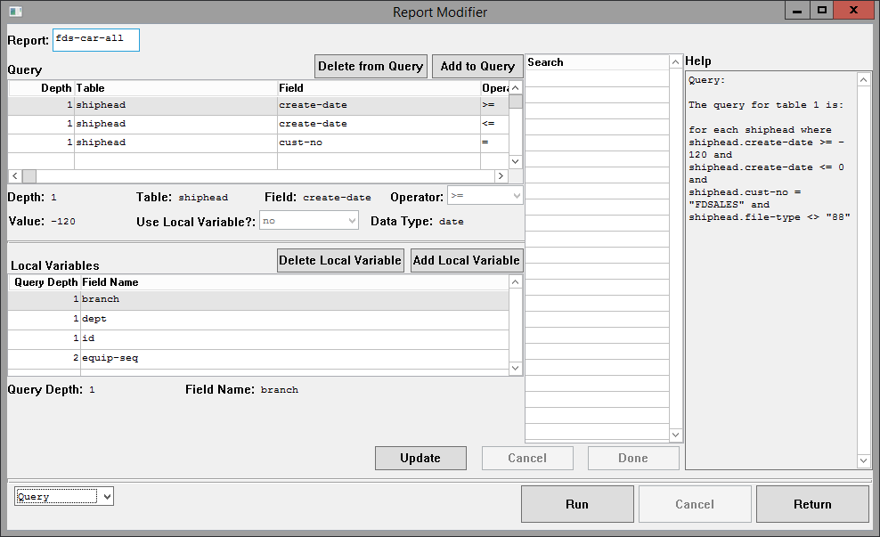
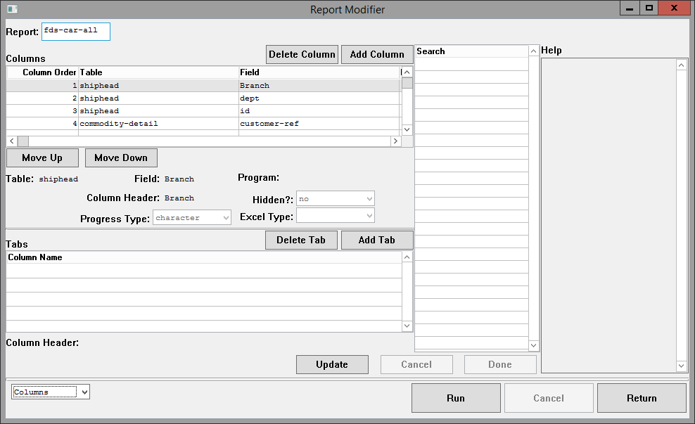
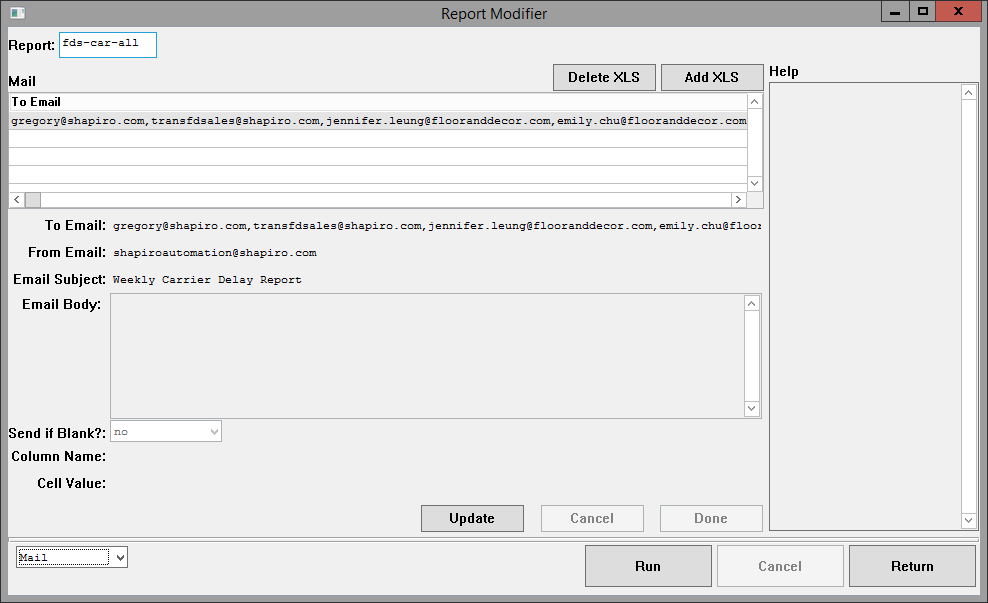
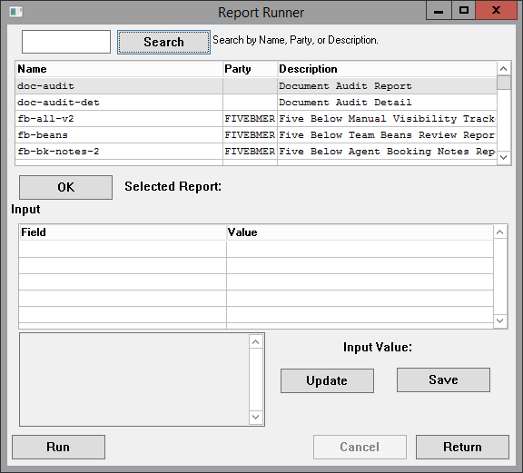

# Tables

The “name” field is the ID which links all tables.

## rpt-hdr

This is the header; a report will not be acknowledged unless it has an rpt-hdr record.

*	name
    *	The program-friendly name for a report. Please don’t use spaces or goofy characters. Try to make it alphanumerics, underscores, and dashes only. It also goes in the filename of the spreadsheet, so don’t put anything uncouth.
*	run-time
    *	The time of day that this should run.
        *	For example: “7:30AM”, “8PM”.
*	run-day	
    *	The day(s) that this should run.
        *	If you want days of the week, specify them like this:
            *	“Monday,Tuesday,Wednesday,Thursday,Friday”
        *	If you want days of the month, specify them like this:
            *	“1,15”
*	calc-prog
    *	The name of an external program to reference. Its behavior is dependent on rpt-hdr.use-remote.
*	use-remote
    *	If this is yes, then it will run as an external report.
        *	This ignores rpt-qry and rpt-det tables. It will call rpt-hdr.calc-prog like this:
            run value(rpt-hdr.calc-prog) (
              input rpt-hdr.name,
              input full-dir + "/",
              input login
            ) no-error.
    *	If this is no, then it will run as an internal report.
        *	This means looking up rpt-qry and rpt-det tables to generate a report.
        *	If rpt-hdr.calc-prog is set, it will be run as a filter.
*	rpt-version
    *	A number representing the version of the report.
*	party
    *	The party associated with this report. Set this to customer.cust-no or the name of a department (“Compliance”, “GLG”, etc.).
*	rpt-desc
    *	The human-readable name for this report.
*	shap360-name
    *	If you leave this blank, no one in Shapiro 360 will see it.
    *	If you set this, it will be visible in Shapiro 360. The value of rpt-hdr.party must be in web-login.us-stats-cust-no-allowed.
*	shap360-users
    *	If this report is visible in Shapiro 360, you can lock it down to certain 360 users.
    *	If you add names here, it will only be visible to those users.
    *	If you leave this blank, it will be visible to all users.

## rpt-xls

This table defines the email which sends this report.
*	name
    *	Should match rpt-hdr.name.
*	col-name
    *	For use in internal reports. Filter on a certain column name when generating the spreadsheet.
*	cell-value
    *	For use in internal reports. Filter on a certain column value when generating the spreadsheet.
*	from-addr
    *	For the email, the address that should send it. Commonly “shapiroautomation@shapiro.com”.
*	to-addr
    *	The recipient email for this report. You can send to multiple emails if you separate them by commas.
*	rpt-title
    *	The subject line of the email.
*	rpt-body
    *	The body of the email. If you leave this blank, it will send a generic message.
*	send-if-blank
    *	If this is yes, you’ll try to send the report even if you don’t have one to send.

## rpt-inp

If your report needs user input, define those input fields here. When the report is run on a schedule, it will look for fields where rpt-inp.login is “SYSTEM”.

For an example of this, see imp/report-fb-all.p:get-date-range.

*	name
    *	Should match rpt-hdr.name.
*	login
    *	The login of the user. This can be “SYSTEM” (when run on a schedule), an Automation login (when run from Automation), or a Joomla numeric user ID (when run from Shapiro 360).
*	inp-seq
    *	Specifies the order that this should be printed. 1 is printed first, then 2, then 3, etc.
*	inp-name
    *	The name of the input field. Put something that will look nice when the user sees it.
        *	Instead of “start-date”, put “Start Date”.
*	inp-value
    *	The value that the user set for this input field.
*	inp-desc
    *	The description of the input field. Put something that will give the user instructions.
        *	For example, if inp-name is “Start Date”, inp-desc could be “Set the starting date for this report.”
*	inp-type
    *	The datatype of this field.
    *	This is important for displaying the report properly in Shapiro 360.

## Important Note

The tables below this are only used for internal reports.

“Internal” does not mean “internal to Shapiro”. It means “the query is run internally inside of imp/report.p”.

If rpt-hdr.use-remote is yes, you can ignore the below tables.

## rpt-qry

This defines the query for finding records to put on the report.

Each rpt-qry record defines one phrase in the “where” clause.

Each rpt-qry record is joined by “and” to create the full where clause.

*	name
    *	Should match rpt-hdr.name.
*	table-depth
    *	There can be multiple queries in a report. This specifies how many queries deep you are.
    *	For instance, say you want to find every bookeq for every shiphead.
        *	Shiphead will be table-depth 1.
        *	Bookeq will be table-depth 2.
*	depth-seq
    *	Ignore this. It should always be 1.
    *	You can use it to set up “or”-like behavior if you super seriously need to.
*	table-name
    *	The table to query.
    *	“shiphead”, “bookeq”, etc.
*	field-name
    *	The field to compare against.
    *	“create-date”, “container-number”, etc.
*	operator
    *	The verb to use.
    *	“=”, “begins”, etc.
*	field-value
    *	The value to compare against.
    *	If field-type is “date”, you can use an integer.
        *	For instance, if you set field-value to “-5”, then it will be calculated as “today - 5”.
    *	If local-var is yes, then set this to the name of a local variable.
        *	For example, “branch”.
*	field-type
    *	The datatype to compare against.
    *	This is important for doing date/numeric comparisons.
*	local-var
    *	If this is yes, then you will compare against a local variable as defined in the rpt-var table.

## rpt-var

When running multi-table queries, you’ll need some way to link one table to another. For example, to find every bookeq for every shiphead, you’ll need to compare branch, dept, and id. rpt-var stores those as local variables at runtime.

*	name
    *	Should match rpt-hdr.name.
*	table-depth
    *	The depth to pull this variable from. Should match rpt-qry.table-depth.
*	depth-seq
    *	Should match rpt-qry.depth-seq.
*	field-name
    *	The field to pull as a local variable.
        *	For example, if you’re pulling from shiphead, this might be “branch”.

## rpt-det

Each rpt-det record defines a column on the report.

*	name
    *	Should match rpt-hdr.name.
*	field-seq
    *	The order of this column on the report.
*	table-name
    *	The name of the table to pull this field from.
        *	For example, “shiphead”.
*	field-name
    *	The name of the field to pull this data from.
        *	For example, “branch”.
*	col-name
    *	The name of the column to display on the spreadsheet.
*	data-type
    *	The Progress datatype.
*	excel-type
    *	The Excel datatype. This is important for formatting columns.
*	calc-prog
    *	If you need to calculate this field, leave field-name blank. Then, set calc-prog to a program name.
    *	It will be called like this:
            run value(rpt-det.calc-prog) (
              input  rpt-hdr.name,
              input  rpt-det.table-name,
              input  dbc:get-curr-rowid(rpt-det.table-name),
              input  rpt-det.col-name,
              input  login,
              output rpt-cell.cell-value
            ) no-error.
*	hidden
    *  	Use this if you want to hide the value of this column.
    *	This is used when you want to pull different rows onto different tabs.

## rpt-tab

If you want more than one tab on your report, create an rpt-tab record.

*	name
    *	Should match rpt-hdr.name.
*	col-name
    *	The name of the column to generate tabs from.
    *	This should match rpt-det.col-name.
*	cell-value
    *	If cell-value is blank, you will create one tab for every unique value in a column.
    *	If you want to filter to one value, specify it here.

# Central Program

Rashi 6 imp/report.p

## Parameters

*	Input
    *	Report time
        *	This determines the output location of the report.
        *	If it’s a time (such as “8AM”, “10AM”, or “1stOfMonth”), it will end up in a directory where schedtask will generate the .xls at a given time.
        *	If it’s blank, it will put the report in a user-specific directory based on the user login input. An email will be sent to {user login}@shapiro.com with realtime master XLS instructions.
        *	If it’s “shapiro360”, it will go to a special directory for Shapiro 360 report downloads. See the documentation on shapiro360/runRpt.p for more information.
    *	Report name
        *	If this is blank, it will run all reports matching a given time.
        *	For example, if “8AM” is your report time, and the report name is blank, it will run all reports scheduled for 8 AM.
    *	User login
        *	If the report is being run on a schedule, then this should be “SYSTEM”.
        *	If it’s run for an internal user, this should be their Automation login. (Hopefully we can just append “@shapiro.com” to get their email address.)
        *	If it’s run for Shapiro 360, this will be their user ID in the Joomla MySQL database. In this case, it will be an integer.

## Body

Kicks off the reports based on your input parameters: whether it should be a scheduled job or an individual report, and whether it goes internal or out to Shapiro 360. This sets the output directory and calls wrt-rpt. It also emails the Automation user if necessary.

## Internal Procedures

There are two kinds of reports: internal and remote.
Internal reports run a database query through imp/report.p. This largely happens in get-depth.
External reports run a database query in an external program. imp/report.p will call this program.
External reports are easier.

*	Internal and external
    *	wrt-rpt
        *	Writes an individual report. If you’re doing a scheduled run for a certain time, you’ll call wrt-rpt once for each report scheduled.
        *	Calls prep-output to set up your individual directories and sendmail scripts.
        *	If reports run inside of imp/report.p, you’ll call:
            *	get-depth to traverse the rpt-qry and rpt-det tables (these tables define the database queries and assign statements which produce reports)
            *	finalize-tabs to split data into tabs if necessary
        *	If reports don’t run inside of imp/report.p, you’ll call remote-report to run the report.
    *	procedure get-full-dir
        *	This will generate one directory for each rpt-xls record. There will be one by default.
*	Internal reports
    *	get-depth
        *	This one’s a doozy.
        *	This builds a query using rpt-qry to find records for pulling data onto the report. One rpt-qry record represents one phrase in the query’s “where” clause.
        *	rpt-det specifies which data you pull onto the report. One rpt-det record represents one column on the report.
        *	Some notes on external programs:
            *	If rpt-hdr.calc-prog is set, get-depth runs a filter function like so:
              run value(rpt-hdr.calc-prog) (
                input  rpt-hdr.name,
                input  table-name,
                input  table-rowid,
                input  "filter",
                input  user-login,
                output continue
              ) no-error.
                *	Use this if you want to skip certain records, but can’t do so through defining rpt-qry records. (For example, if you need logic involving “or”.)
                *	If continue is Y, then it will put this record on the report. Otherwise, it will skip this record.
            *	If rpt-det.calc-prog is blank, then it will pull the value out of the database directly.
            *	If rpt-det.calc-prog is set, it will run that program to determine the value to put in the cell. It calls rpt-det.calc-prog like so:
                run value(file-info:full-pathname) (
                  input  rpt-hdr.name,
                  input  rpt-det.table-name,
                  input  dbc:get-curr-rowid(rpt-det.table-name),
                  input  rpt-det.col-name,
                  input  login,
                  output rpt-cell.cell-value
                ) no-error.
    *	prep-output
        *	Prepare directories for CSV files to go in.
        *	Write rpt-list.txt so that the master XLS knows to run this report.
        *	Append to send-script.sh so that you mail the report out (if it’s scheduled).
    *	procedure open-report
        *	Create directories to house .csv and .xls files.
    *	procedure finalize-tabs
        *	Write the header line in each .csv file you’ve generated.
    *	procedure open-tab
        *	Not called.
    *	procedure output-line
        *	Outputs lines in every relevant directory.
    *	procedure print-line-by-tabs
        *	Outputs lines to every relevant .csv file.
    *	print-line-to-file
        *	Read the rpt-cell table and put data in a .csv file.
*	External reports
    *	remote-report
        *	Calls a program to generate .csv files into a directory. Calls the program like so:
            run value(file-info:full-pathname) (
              input rpt-hdr.name,
              input full-dir + "/",
              input login
            ) no-error.

## Examples of Calls

imp/report.p (
  input “7:30AM”,
  input “”,
  input “SYSTEM”
).
In this case, we’re running all of the morning reports.

imp/report.p (
  input “shapiro360”,
  input “fb-draft”,
  input “648”
).
A user on 360 is running the Five Below All PO report. The Joomla user ID is 648.

imp/report.p (
  input “realtime”,
  input “mr-fb-pom”,
  input “gregory”
).
Automation user “gregory” is running the M+R Five Below POM report. Because the time is “realtime”, the realtime XLS will be emailed to “gregory@shapiro.com”. (It will be S:\CORP-DAILY\realtime\gregory\realtime-master.xls.)

imp/report.p (
  input “”,
  input “fb-onwat-fb”,
  input “SYSTEM”
).
Someone is testing the Five Below On the Water report. They must have typed this into the Progress Editor. This run will end up in CORP-DAILY/rpt/realtime.

# Automation

These are programs in Automation for updating and running reports.

I have tried to put advice in the “Help” box on the right in this program. Or rather, I have put advice in that box, and I have tried to make it good advice.

## Report Modifier

Before starting, you must enter a report name in “Report:” and hit Enter.

If you don’t know one, hit F6 to look one up.

Or, if you want to create a new report, type the name for it and hit Enter. Please make it program-friendly (alphanumerics, underscores, and dashes only).

Use the “Run” button to run the report. It’ll email you a realtime master XLS.

### Header

#### Header

*	Program
    *	If Use Remote? is yes, then Program will be called like this:
        *	        run value(rpt-hdr.calc-prog) (
                      input rpt-hdr.name,
                      input full-dir + "/",
                      input login
                    ) no-error.
    *	If Use Remote? is no, then Program will be used as a filter, like this:
        *	          run value(rpt-hdr.calc-prog) (
                        input  rpt-hdr.name,
                        input  table-name,
                        input  table-rowid,
                        input  "filter",
                        input  user-login,
                        output continue
                      ) no-error.
*	Description
    *	A human-readable description for the program.
*	Party
    *	The party for this program. You can leave it blank, set it to a customer code, or set it to a Shapiro department.
*	Version
    *	A number representing the version of the program.
*	Use remote?
    *	This determines the behavior of the Program field. If you set this to yes, then you can have most of the Progress programming coming out of your own program.
*	Shapiro 360 Name
    *	If you want to display this in Shapiro 360, set this. The Party must match the customer code for a user.
*	Shapiro 360 Users
    *	If you leave this blank, it’ll display to all users matching the Party. If you set it, this report will only show to the users specified.

#### Input

*	Field Name
    *	The name of the field. Make it nice to look at; do “Start Date”, not “start-date”.
*	Default Value
    *	The default value. This will be used if the report is run on a schedule. It will also auto-populate for a user before they have set their own preferred value.
*	Data Type
    *	The datatype for this field. It’s important to specify this so you can perform accurate numeric or date comparisons.
*	Description
    *	You can use this to give instructions to the user if you need to.

### Query

You will only need this if “Use Remote?” is no.

#### Query

Every record here defines a phrase in the “where” clause.

*	Depth
    *	If you are querying tables within tables, this specifies which query you are talking about.
    *	For instance, say you are querying every bookeq for every shiphead.
        *	shiphead would be Depth 1.
        *	bookeq would be Depth 2.
*	Table
    *	The table to query.
*	Field
    *	The field to compare against.
*	Operator
    *	The verb to use: “=”, “begins”, etc.
*	Value
    *	The value to compare against.
    *	If Data Type is “date”, then you can put an integer here to perform comparisons relative to today.
        *	For example, if you enter “-5”, then the comparison will be against “today - 5”.
*	Use Local Variable?
    *	Usually this is no. But, if you want to compare against the value of a local variable, select yes.
    *	If you select yes, then “value” must be the name of a local variable (“branch”, “dept”, etc.).
    *	Note that you must define local variables below.
*	Data Type
    *	The datatype of the field you’re comparing against.

#### Local Variables

*	Query Depth
    *	Which depth to pull this local variable from.
    *	If you’re querying every bookeq for every shiphead:
        *	shiphead will be Depth 1.
        *	bookeq will be Depth 2.
*	Field Name
    *	The field to pull into a local variable.
    *	In the shiphead/bookeq example:
        *	You’ll want to pull “branch”, “dept”, and “id” from Depth 1.

### Columns

You will only need this if “Use Remote?” is no.

#### Columns

*	Move Up/Move Down
    *	Use these to change the order of columns on the report. The columns are printed in order from left to right.
*	Table
    *	The table to pull this column from.
*	Field
    *	The field name to pull this column from.
*	Program
    *	If you need to calculate the value of this field, put in a program name. It will be called like this:
            run value(rpt-det.calc-prog) (
              input  rpt-hdr.name,
              input  rpt-det.table-name,
              input  dbc:get-curr-rowid(rpt-det.table-name),
              input  rpt-det.col-name,
              input  login,
              output rpt-cell.cell-value
            ) no-error.
*	Column Header
    *	The title for the column to print in the spreadsheet.
*	Hidden?
    *	Use this to hide a column. You’ll want to do that if you are creating tabs.
*	Progress Type
    *	The datatype of the variable in progress.
*	Excel Type
    *	The format of the value in the Excel spreadsheet.
    *	This is important to set so that integers don’t turn into scientific notation and so that dates don’t get reformatted.

#### Tabs

Only bother with this if you want multiple tabs in your report.

*	Column Header
    *	Set this to the Column Header from the above form.
    *	There will be one tab for each unique value in this column.
        *	For example, if you set it on the “Port of Entry” column, then you might have tabs like:
            *	“LOS ANGELES, CA”
            *	“MEMPHIS, TN”
            *	“BALTIMORE, MD”

### Mail

*	To Email
    *	The email to receive this report.
*	From Email
    *	The email to send this report.
*	Email Subject
    *	The subject line for the email.
*	Email Body
    *	The body text for the email. If you leave it blank, we’ll send a generic message.
*	Send if Blank?
    *	If there’s no report to send, then you can prevent us from sending anything.
    *	Set this to “yes” if you want the mailer to run even if we don’t have a report.
*	Run time
    *	The time of day to run.
*	Run day
    *	The day of week to run.
*	Run month
    *	The month to run. Leave blank if it should run every month.
*	Column Name
    *	Use this to filter reports. Probably leave it blank.
*	Cell Value
    *	Use this to filter reports. Probably leave it blank.

## Report Runner

*	Search
    *	Type in a report name, party, or description.
*	OK
    *	Hit this to select a report from the table. You need to hit “OK” before you can run it.
*	Input
    *	This table displays user input fields.
    *	The program will set up defaults for you.
    *	You can change them using the “Input Value” text input.
*	Input Value
    *	Click “Update” to change an input value.
    *	Click “Save” to save your new input value.
*	Run
    *	This kicks off a report. Once it’s done, you will receive an email with the report.
*	Cancel
    *	You will need to wait while a report runs. If you cannot wait, you can click “Cancel”.
    *	If you click “Cancel”, your report will not finish.
*	Return
    *	Use this to exit the Report Runner.

# Master XLS

There are two different master XLSes. One is run during a scheduled run, and another is sent to users for running in real time.

Folder structure:
S:\CORP-DAILY\rpt\{time that the report runs}\{report name}\{spreadsheet group}\{CSV files}

For example:
S:\CORP-DAILY\rpt\10am\fb-draft\rpt\allpo.csv

Each spreadsheet group will have one spreadsheet. Every file in the {CSV files} folder will be put as one tab on the same spreadsheet.

## Scheduled

S:\CORP-DAILY\rpt\master.xls

*	auto_open()
    *	Get a list of report names to run out of rpt-list.txt. This goes in a variable called ReportNames.
    *	Each report name defines a directory to look in.
    *	For each directory, examine all sub-directories. This goes in SubFolder.
    *	For each subfolder, examine all CSV files. This goes in CSVNames.
    *	Run format_cells() for each entry in CSVNames.
    *	Each CSV file is a tab on the report.
    *	For each subfolder, save an XLS.
    *	Move all CSV files into the archive directory.
    *	Delete rpt-list.txt.
    *	Quit out of the Excel macro.
*	format_cells()
    *	If this is a special tab (marked as “PIE CHART” or “BAR GRAPH”), pass it off to pie_chart() or bar_graph() as is appropriate.
    *	If you’re not a special tab, run normally.
    *	Set the borders.
    *	Examine the header cell of each column.
        *	Apply formatting (bold text, gray background).
        *	Format the column if any formatting is specified.
            *	“ (DATE)” – format as a date
            *	“ (INTEGER)” – format as an integer
            *	“{header};NumberFormat;{format}” – format the column with whatever is in {format}
                *	Example: “Item Price;NumberFormat;0.0000” will apply number format “0.0000” to the column. The header will only say “Item Price” afterwards.
    *	For each cell, replace the text “(NEWLINE)” with an actual newline.
    *	Autofit and autofilter all cells.
*	pie_chart()
    *	First row format:
        *	PIE CHART,{name},{number of rows}
            *	“PIE CHART” must be there to tell the macro that it’s a pie chart.
            *	{name} is the name of your pie chart.
            *	{number of rows} is the number of rows of data you’re sending.
    *	Then each subsequent row must have this format:
        *	{name},{value}
            *	{name} is the name of the pie chart slice.
            *	{value} is the value associated with the pie chart slice.
*	bar_graph()
    *	First row format:
        *	BAR GRAPH,{name},{number of rows},{special},”DATA LABELS”
            *	“BAR GRAPH” must be there to tell the macro that it’s a bar graph.
            *	{name} is the name of your bar graph.
            *	{number of rows} is the number of rows of data that you’re sending.
            *	{special} is optional. It lets you format the bar graph.
                *	“DOUBLE BAR” – show columns clustered side by side
                *	“100% STACK” – show columns stacked on top one another to reach 100%
            *	If you want data labels, you must put “DATA LABELS” in the fifth spot. This is optional.
    *	The second row must have this format:
        *	,{name 1},{name 2}
            *	The first spot must be blank.
            *	{name 1} is the label of each bar.
                *	For example: if the bars are labelled “Brazil” and “Turkey”, then {name 1} should be “Country”.
            *	{name 2} is the value for each bar.
                *	For example: if the bars show the percentage of compliance, then {name 2} should be “% compliant”.
    *	Then each subsequent row must have this format:
        *	{label},{value}
            *	{label} is the name of a data point.
            *	{value} is the value for a data point.
*	Col_Letter()
    *	Find the letter corresponding to a column.
*	HexToLongRGB()
    *	Convert a hexadecimal color code to RGB.

## Realtime

S:\CORP-DAILY\rpt\realtime-master.xls

This is the same as the scheduled XLS, except it keeps the report open so the user can read it.

# Shapiro 360

## Report Getter

shapiro360/getRpt.p

This program checks if you’re allowed to access a report.

It also passes back any input fields for the report as defined in rpt-inp. This is so that custom-report.php can display input fields for the user to fill out. For instance, say your report has a start date and an end date; this will pass back two input fields, one for each date.

### Parameters

*	Input
    *	web-login.user-login
    *	rpt-hdr.name
*	Output
    *	Error message
    *	Human-readable report name
    *	A temp table of user input fields

## PHP Script

custom-report.php

### Initialization

A report name is passed in through $_GET[‘rpt’]. This report name is passed into the report getter in order to draw the page.

The report getter gives you the title to display on the page.

It also gives you the input fields to display. For each row in ttInput, it draws an input field. If it’s an integer, the page draws a number input; if it’s a date, the page draws a date picker; otherwise, the page draws a regular text input.

### Input Parameters

This report reads the “rpt” GET variable. This corresponds to a value in rpt-hdr.name.

### Functions

*	JavaScript
    *	window.addEventListener(‘load’)
        *	Set the page name.
        *	If you have any date inputs, initialize the date picker.
    *	run_rpt()
        *	Pack up the input fields and call the report runner.
        *	This kicks off ping_file().
    *	ping_file()
        *	Check to see if your report has finished running.
        *	If it’s done, download it.
        *	If it’s not done, check again in 1 second.
        *	This uses setInterval().
        *	The report will be at https://shapiro360.shapiro.com/vdocs/reports/{user_id}_{report name}_{timestamp}.xlsx.
        *	However, ping_file() checks for a .txt file. This file is created once the .xlsx is completely written. This prevents the user from downloading a half-written spreadsheet.
        *	For big reports (Five Below All PO Report), this can run for like five minutes.

## Report Runner

shapiro360/runRpt.p

Take the user’s input and create rpt-inp records.

Then, run the report through imp/report.p.

Once that is done, call the Master PY.

### Parameters

*	Input
    *	web-login.user-login
    *	Joomla user ID
    *	rpt-hdr.name
    *	timestamp
    *	input temp-table
*	Output
    *	Error message
    *	Location of the report
        *	This isn’t used by the PHP script, since the web service will time out on larger reports. That’s okay, because the Progress program will continue running, even though it will never return to the PHP script.

### Internal Procedures

*	crt-inp
    *	This creates rpt-inp records based on data the user passed in.
    *	This scheme allows you to save the user’s input to the database so that it can be read from any program.

## Master PY

shapiro360/openpyxl-2.5.4/report.py

This uses the Python library openpyxl.

### Input Parameters

*	Input folder – folder to read CSVs from
*	Output – the filename to save an XLSX into, minus the file extension

### Body

Read every CSV file out of the input folder one by one.

Run normal_sheet(), pie_chart(), or bar_graph() as is appropriate.

Save the output XLSX.

Once that’s done, save a TXT file to communicate that the XLSX is fully written.

### Functions

*	as_text()
    *	Return the value of a cell as a string.
*	normal_sheet()
    *	Process a CSV file as a normal sheet. This mirrors format_cells() from the Master XLS.
*	pie_chart()
    *	Process a CSV as a pie chart. This mirrors pie_chart() from the Master XLS.
*	bar_graph()
    *	Process a CSV as a bar graph. This mirrors bar_graph() from the Master XLS.

# Scheduled Runs

## Rashi 6: Generate .csv Files

* The demon1 crontab runs /usr/bin/run_report_sched.sh runs on the 15th and 45th minute of each hour.
* That calls /usr/bin/mxp_report.pf.
* That calls imp/report-sched.p.
* imp/report-sched.p figures the time and passes it into imp/report.p.
    * For instance, if the time is between 7:10 AM and 7:39 AM, imp/report-sched.p will pass "8AM" to imp/report.p.

## schedtask: Generate .xls Files

* The Task Scheduler calls C:\bat\report.bat on the 15th and 45th minute of each hour.
* It will determine what time to run.
    * For instance, if the time is between 7:40 AM and 8:09 AM, it will get the time "8AM".
* It will look for a directory according to this time.
    * This will be in the format: \\myshapiro\dfs\corp-daily\rpt\{TIME}
* If the directory exists, and it has a master XLS and rpt-list.txt, then report.bat will run the master XLS.

## Rashi 6: Mail .xls Files

* The demon1 crontab runs /usr/bin/mail_report_sched.sh on the 0th and 30th minute of each hour.
* It will look for a mail script according to the time.
    * The mail script will be in this location: /usr5/dailyreports/rpt/{TIME}/send-script.sh
* If the mail script is there, mail_report_sched.sh will run it.
